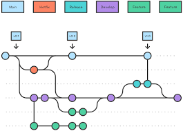
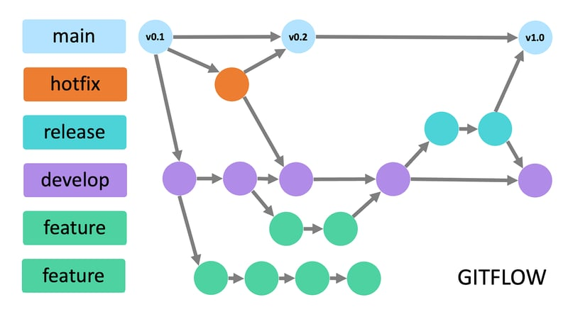
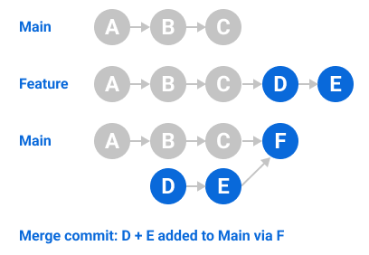
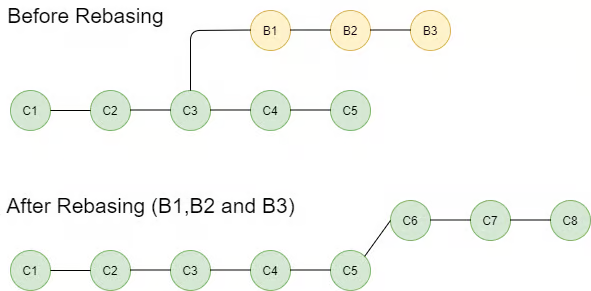
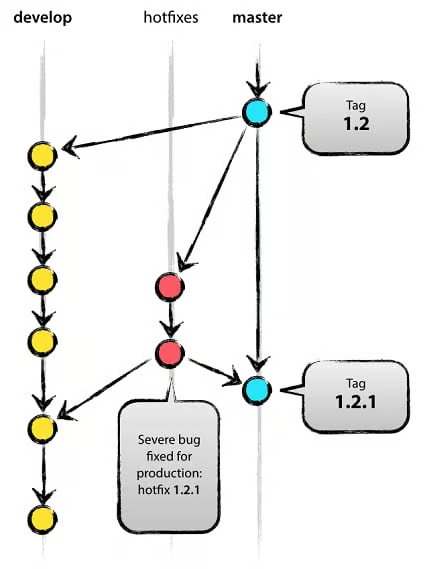
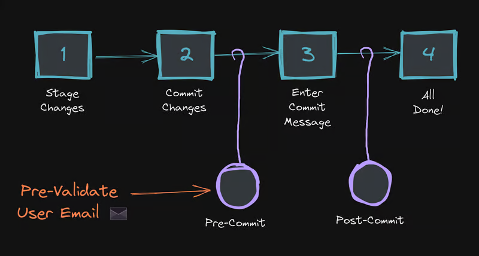
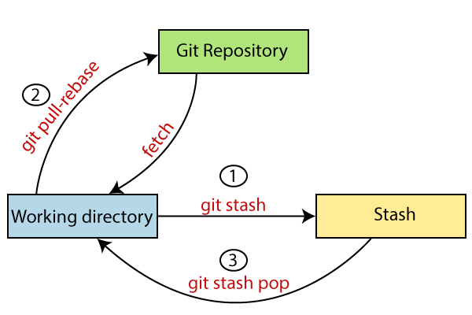
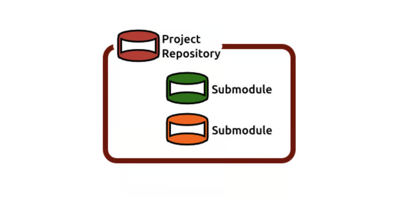
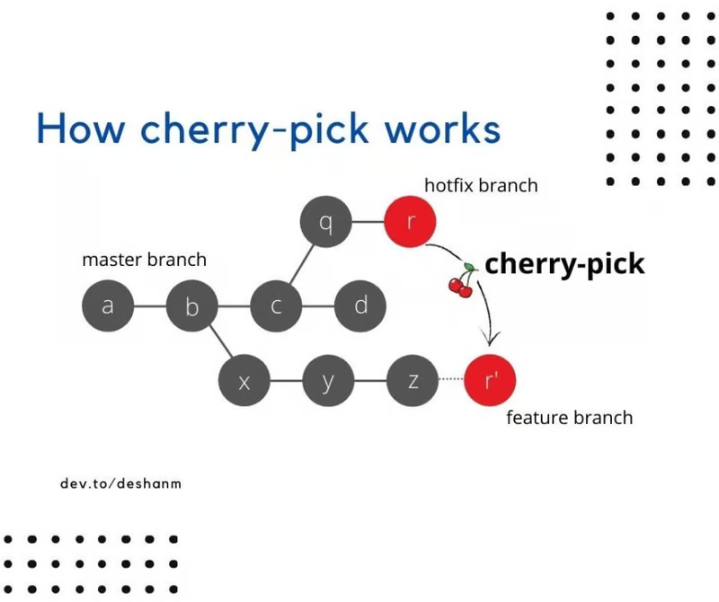

# Branching Strategies
Branching allows developers to work on independent lines of code without affecting the main codebase. 

# GitFlow
Favored by larger teams, GitFlow employs a dedicated set of branches

### Master
The sacrosanct production branch, holding only the most stable and thoroughly tested code.

### Develop
The central development branch where ongoing features and bug fixes are integrated.

### Feature Branches
Short-lived branches branched from develop for specific features, merged back after completion.

### Hotfix Branches
Short-lived branches branched directly from master for urgent bug fixes, later merged back to develop and master.
Release Branches: Short-lived branches branched from develop to prepare releases for different environments.

(Source: [Mastering Version Control with Git: Beyond the Basics](https://dev.to/gauri1504/mastering-version-control-with-git-beyond-the-basics-44ib))

# GitHub Flow
More lightweight and suitable for smaller teams, GitHub Flow utilizes:

### Master
Similar to GitFlow, holding only production-ready code.

### Hotfix Branches
Similar to GitFlow, used for critical bug fixes, merged directly into master and deleted afterward.

(Source: [Mastering Version Control with Git: Beyond the Basics](https://dev.to/gauri1504/mastering-version-control-with-git-beyond-the-basics-44ib))

### Strengths and Suitability:
GitFlow offers structured control for larger teams, ensuring code stability before reaching production. However, it 
requires stricter enforcement of branch naming conventions and workflows. GitHub Flow is simpler and faster for smaller 
teams, focusing on continuous integration and rapid iteration. Choose the strategy that best suits your project's size, 
complexity, and team structure.

**Strengths and Suitability**
GitFlow offers structured control for larger teams, ensuring code stability before reaching production. However, it 
requires stricter enforcement of branch naming conventions and workflows. GitHub Flow is simpler and faster for smaller 
teams, focusing on continuous integration and rapid iteration. Choose the strategy that best suits your project's size, 
complexity, and team structure.

## Feature Branch Workflows
Feature branches are the workhorses of Git development. Here's how to optimize your workflow with them:

### Create Clear and Descriptive Branch Names
Use a consistent naming convention (e.g., feature/new-login-system) to improve project clarity and discoverability.

### Regular Code Reviews
Before merging back to the main branch, have another developer review your code for quality, efficiency, and adherence 
to coding standards. Utilize platforms like GitHub or GitLab's built-in review features for streamlined communication.

### Merging Strategies
Employ either "merge" or "rebase" strategies to integrate your feature branch.

### Merge
Creates a merge commit, recording the integration point between your branch and the main branch. This is simpler but can
lead to a more complex Git history.

## Feature Branch Workflows
Feature branches are the workhorses of Git development. Here's how to optimize your workflow with them

### Create Clear and Descriptive Branch Names
Use a consistent naming convention (e.g., feature/new-login-system) to improve project clarity and discoverability.

### Regular Code Reviews
Before merging back to the main branch, have another developer review your code for quality, efficiency, and adherence 
to coding standards. Utilize platforms like GitHub or GitLab's built-in review features for streamlined communication.

### Merging Strategies
Employ either "merge" or "rebase" strategies to integrate your feature branch

### Merge
Creates a merge commit, recording the integration point between your branch and the main branch. This is simpler but can 
lead to a more complex Git history.

(Source: [Mastering Version Control with Git: Beyond the Basics](https://dev.to/gauri1504/mastering-version-control-with-git-beyond-the-basics-44ib))

### Rebase
Re-writes your feature branch's commits on top of the latest main branch commits, resulting in a cleaner Git history. 
However, rebasing requires caution, as it can rewrite history seen by other collaborators.

(Source: [Mastering Version Control with Git: Beyond the Basics](https://dev.to/gauri1504/mastering-version-control-with-git-beyond-the-basics-44ib))

## Conflict Resolution Techniques
Merging conflicts can arise when changes made on separate branches affect the same lines of code. Learn to identify and 
resolve conflicts using Git's built-in merge tools or manual editing.

## Branching for Hotfixes and Releases
Dedicated branches serve specific purposes beyond feature development

### Hotfix Branches
For critical bug fixes that need immediate deployment, create hotfix branches directly from the master. Fix the issue, 
thoroughly test in a staging environment, and merge the hotfix back to master (and develop if applicable) for a quick 
resolution. Delete the hotfix branch once merged.

(Source: [Mastering Version Control with Git: Beyond the Basics](https://dev.to/gauri1504/mastering-version-control-with-git-beyond-the-basics-44ib))

### Release Branches
Prepare releases with dedicated branches branched from develop. Integrate bug fixes, final feature polish, and 
documentation updates. Once rigorous testing is complete, merge the release branch to master to deploy. Consider tagging
the commit in master for version control purposes.

## Collaborative Workflows with Git
### Forking and Pull Requests
Platforms like GitHub and GitLab allow developers to "fork" a repository, creating a personal copy. On their forks, they
can create feature branches, implement changes, and then submit "pull requests" to the original repository. This triggers 
a code review process where maintainers can review the changes, suggest modifications, and approve the pull request to 
merge the code into the main branch.

### Resolving Merge Conflicts
When multiple developers work on the same files in separate branches, merge conflicts occur. Git will typically highlight 
these conflicts, and it's your responsibility to manually edit the files to resolve them. Tools like Git's merge tool or 
visual merge editors in Git clients can streamline this process.

### Working with a Remote Repository
Centralize your version control using a remote repository service like GitHub or GitLab. This offers numerous benefits.

### Collaboration
Team members can easily fork, clone, and push code to the remote repository, facilitating collaborative development.
Version Control History: The remote repository maintains a complete Git history, allowing you to revert to previous 
versions or track code evolution.

### Backup and Disaster Recovery
In case of local machine failures, the remote repository ensures a safe backup of your codebase.

### Git Hooks for Automated Tasks
Git hooks are scripts that run automatically at specific points in your Git workflow, adding automation and enforcing best practices.

### Types of Git Hooks
There are several predefined hook types

### Pre-commit
Runs before a commit is made, allowing you to enforce coding standards or run linting checks.

### Post-commit
Runs after a commit is made, useful for updating build versions or sending notifications.

(Source: [Mastering Version Control with Git: Beyond the Basics](https://dev.to/gauri1504/mastering-version-control-with-git-beyond-the-basics-44ib))

### Pre-push
Runs before code is pushed to a remote repository, often used for final checks or tests.

### Post-push
Runs after code is pushed, potentially triggering deployments or integrations. Common Git Hook Use Cases: Git hooks can 
automate various tasks.

### Code Formatting
Enforce consistent code style using hooks that run code formatters like autopep8 or clang-format before commits.

### Unit Tests
Run automated unit tests with hooks like pytest or Jest before pushing code, ensuring basic functionality before integration.

### Static Code Analysis
Integrate static code analysis tools like Pylint or ESLint into your workflow via pre-commit hooks to identify potential 
errors or vulnerabilities.

### Creating Custom Git Hooks
While predefined hooks cover common needs, you can create custom hooks using scripting languages like Bash or Python. 
Refer to Git's documentation for detailed instructions on creating and configuring custom hooks.

### Git for Non-Programmers
Git isn't just for programmers! It's valuable for anyone working on collaborative projects with text-based files. Use it 
for managing documents, configuration files, or even creative writing projects with version control.

Advanced Git Topics:

### Stashing
Temporarily save uncommitted changes for later use.

(Source: [Mastering Version Control with Git: Beyond the Basics](https://dev.to/gauri1504/mastering-version-control-with-git-beyond-the-basics-44ib))

### Submodules
Manage dependencies between different Git repositories within a larger project.

(Source: [Mastering Version Control with Git: Beyond the Basics](https://dev.to/gauri1504/mastering-version-control-with-git-beyond-the-basics-44ib))

### Rebasing
Reorganize your Git history for a cleaner linear progression (use with caution!).

# Deep Dive into Git: Advanced Techniques and Power User Tips
### Advanced Branching Strategies
Feature Flags and Branch Toggling: Manage the rollout of new features to specific environments or user groups using 
feature flags. Couple this with Git branching to create feature branches with feature flags enabled, allowing for staged 
rollouts and controlled deployments.

### Git Mirroring
Create a synchronized copy of a remote repository for disaster recovery or redundancy purposes using Git mirroring. This
establishes a complete replica of the repository on another server, ensuring data safety in case of outages or accidental
deletions.

### Cherry-Picking and Rebasing for Advanced Version Control
These techniques offer granular control over your Git history

### Cherry-Picking
Select and apply specific commits from one branch to another, useful for incorporating bug fixes from a hotfix branch 
without merging the entire branch.

(Source: [Mastering Version Control with Git: Beyond the Basics](https://dev.to/gauri1504/mastering-version-control-with-git-beyond-the-basics-44ib))

### Rebasing (Interactive)
Rewrite Git history by rearranging, editing, or squashing commits. Interactive rebasing allows for more fine-grained 
control over the rewriting process. Utilize these techniques cautiously, as they can alter history seen by collaborators
and require careful coordination.

# Git Porcelain Commands and Refactoring
### Detachable HEAD and Rebasing Workflows
The HEAD in Git refers to the currently checked-out commit. A detachable HEAD allows you to detach it from the working 
directory, enabling advanced workflows like complex rebases. This is a powerful but conceptually challenging feature.

### Interactive Rebasing
As mentioned earlier, interactive rebasing allows for editing existing commits and restructuring your Git history interactively. You can:

Split a large commit into smaller, more focused commits.
Combine multiple commits into a single commit.
Edit the commit message of an existing commit.
Reorder commits to reflect the logical flow of development.
Git Porcelain Commands for Everyday Tasks: Git offers a suite of powerful "porcelain" commands for various use cases:

`git add -p (patch)`

Stage specific changes within a file instead of the entire file.

`git stash`

Temporarily stash uncommitted changes for later retrieval, useful for switching contexts or testing branches.
git lfs (Large File Storage):
Manage large files (videos, images) efficiently within your repository using Git LFS, which stores them separately without bloating the repository size

# Git with Large Codebases
### Git Large File Storage (LFS)
As mentioned earlier, Git LFS is crucial for managing large files within a Git repository. It tracks these files in the 
repository but stores them in a separate location, keeping the main repository lean and efficient.

### Submodules for Modular Development
Break down large projects into smaller, modular components managed by separate Git repositories. You can integrate these 
submodules into a larger project (monorepo) while maintaining independent version control for each module.

# Git for Distributed Teams and Continuous Integration (CI)
### Remote Repositories
Centralize version control on platforms like GitHub or GitLab, enabling everyone to clone, push, and pull code seamlessly.

### Branching Strategies:
Employ clear branching strategies like GitFlow or GitHub Flow to manage concurrent development and avoid conflicts.

### Communication and Coordination:
Maintain clear communication channels and utilize tools like pull request reviews and issue trackers for effective collaboration.

### Git Integration with CI/CD Pipelines:
Continuous Integration and Continuous Delivery (CI/CD) pipelines automate builds, testing, and deployments. Integrate Git with your CI/CD pipeline to trigger these processes automatically upon code changes:

### CI Triggers:
Configure your CI system to trigger builds and tests whenever code is pushed to a specific branch.
Deployment Automation: Automate deployments to different environments (staging, production) based on successful builds and tests.

### Git Hooks for CI Pipelines:
Custom Git hooks can trigger specific actions within your CI pipeline:

### Pre-push Hooks:
Run code quality checks or unit tests before pushing code, preventing regressions before they reach the remote repository.

### Post-push Hooks:
Trigger deployments or automated notifications upon successful pushes.

### Git for Version Control of Non-Code Assets:
Git isn't limited to code. Use it for managing version control of non-code assets like:

### Documentation:
Track changes to documentation files over time.
Configuration Files: Maintain different configurations for development, staging, and production environments.

### Design Mockups:
Version control design assets like mockups and prototypes for easy collaboration and iteration.

### Visualizing Git History:
Tools like "git log --graph" or graphical clients like GitKraken can visualize your Git history in a user-friendly format, helping you understand branching and merging activity at a glance.

### Source
* [Mastering Version Control with Git: Beyond the Basics](https://dev.to/gauri1504/mastering-version-control-with-git-beyond-the-basics-44ib)